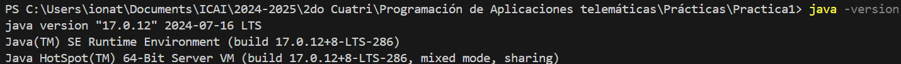
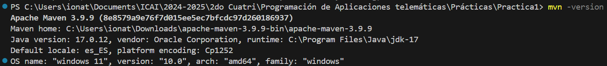
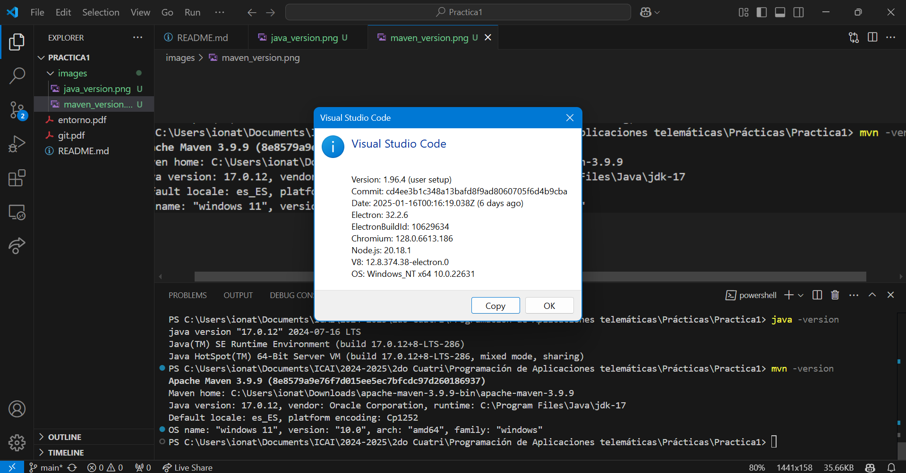
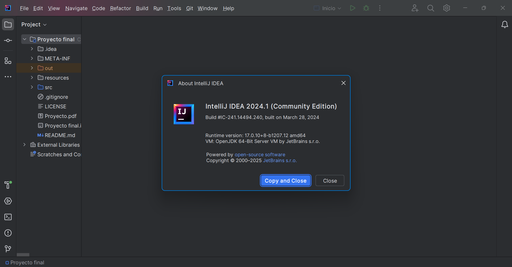

# Práctica 1: Entorno de Desarrollo

## Descripción
Esta práctica tiene como objetivo configurar el entorno de desarrollo necesario y adquirir nociones básicas sobre el uso de Git y GitHub. A continuación, se detalla el desarrollo de cada apartado.

## Git y GitHub

### Pasos realizados

1. **Hacer fork del repositorio**
   - URL del repositorio: [https://github.com/gitt-3-pat/p1](https://github.com/gitt-3-pat/p1).

2. **Comandos probados**

   - **`git clone`**
     - **Descripción:** Copia un repositorio remoto completo a local, incluyendo su historial.
     - **Comando ejecutado:**
       ```bash
       git clone https://github.com/gitt-3-pat/p1
       ```
     - **Log:**
       ```
       Cloning into 'p1'...
       remote: Enumerating objects: 15, done.
       remote: Counting objects: 100% (15/15), done.
       remote: Compressing objects: 100% (10/10), done.
       remote: Total 15 (delta 2), reused 12 (delta 1), pack-reused 0
       Receiving objects: 100% (15/15), 4.56 KiB | 4.56 MiB/s, done.
       Resolving deltas: 100% (2/2), done.
       ```

   - **`git status`**
     - **Descripción:** Muestra el estado del repositorio, indicando si hay cambios no confirmados.
     - **Comando ejecutado:**
       ```bash
       git status
       ```
     - **Log:**
       ```
       On branch main
       Your branch is up to date with 'origin/main'.

       nothing to commit, working tree clean
       ```

   - **`git add`**
     - **Descripción:** Prepara los cambios realizados para ser confirmados.
     - **Comando ejecutado:**
       ```bash
       git add .
       ```
     - **Log:** Sin salida visible al ejecutarse correctamente.

   - **`git commit`**
     - **Descripción:** Guarda los cambios preparados en el historial del repositorio.
     - **Comando ejecutado:**
       ```bash
       git commit -m "Update README.md"
       ```
     - **Log:**
       ```
       [main 2813d98] Update README.md
        1 files changed, 92 insertions(+), 16 deletions(-)
       ```

   - **`git push`**
     - **Descripción:** Envía los commits desde el repositorio local al remoto.
     - **Comando ejecutado:**
       ```bash
       git push origin main
       ```
     - **Log:**
       ```
       Enumerating objects: 5, done.
       Counting objects: 100% (5/5), done.
       Delta compression using up to 8 threads
       Compressing objects: 100% (2/2), done.
       Writing objects: 100% (3/3), 1.54 KiB | 1.54 MiB/s, done.
       Total 3 (delta 0), reused 0 (delta 0), pack-reused 0
       To https://github.com/ionatecrz/Practica1.git
          07720b5..2813d98  main -> main
       ```

   - **`git checkout`**
     - **Descripción:** Cambia entre ramas o restaura archivos específicos.
     - **Comando ejecutado:**
       ```bash
       git checkout -b development
       ```
     - **Log:**
       ```
       Switched to a new branch 'development'
       ```

## Entorno de Desarrollo Java

### Instalación y verificación

1. **Java 17**
   - **Comando ejecutado:**
     ```bash
     java -version
     ```
   - **Log:**
     ```
     java "17.0.12" 2024-07-16 LTS
     Java(TM) SE Runtime Environment (build 17.0.12+8-LTS-286)
     Java HotSpot(TM) 64-Bit Server VM (build 17.0.12+8-LTS-286, mixed mode, sharing)
     ```

     

2. **Apache Maven**
   - **Comando ejecutado:**
     ```bash
     mvn --version
     ```
   - **Log:**
     ```
     Apache Maven 3.9.9 (8e8579a9e76f7d015ee5ec7bfcdc97d260186937)
     Maven home: C:\Users\ionat\Downloads\apache-maven-3.9.9-bin\apache-maven-3.9.9
     Java version: 17.0.12, vendor: Oracle Corporation, runtime: C:\Program Files\Java\jdk-17
     Default locale: es_ES, platform encoding: Cp1252
     OS name: "windows 11", version: "10.0", arch: "amd64", family: "windows"
     ```
     

3. **Editores de código**
   - **Visual Studio Code**
     - **Versión:** 1.96.4.
     - Configuración básica con extensiones relevantes para Java.
     
     

   - **IntelliJ IDEA**
     - **Versión:** 2023.3.4.
     - Configuración integrada con Maven y Java 17.

     

## Estructura del repositorio

- [images](https://github.com/ionatecrz/Practica1/blob/main/images): Carpeta con las imágenes del entorno de desarrollo Java.
- [git.pdf](https://github.com/ionatecrz/Practica1/blob/main/git.pdf): Documento explicativo de los comandos Git utilizados.
- [entorno.pdf](https://github.com/ionatecrz/Practica1/blob/main/entorno.pdf): Evidencias de instalación del entorno de desarrollo Java.
- [README.md](https://github.com/ionatecrz/Practica1/blob/main/README.md): Memoria explicativa de la práctica.

## Enlace al repositorio

[Repositorio de la práctica](https://github.com/ionatecrz/Practica1)

## Autores

- **Nombre del autor:** Íñigo de Oñate Cruz
- **Contacto:** [LinkedIn](https://www.linkedin.com/in/%C3%AD%C3%B1igo-de-o%C3%B1ate-cruz-855b55263/)
